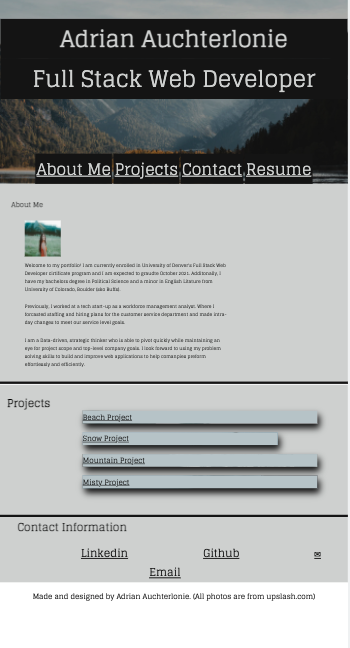

# adrian-portfolio

##

Web application was created to show inform users about me, showcase future projects and my contact information. The project main motivation was to have a single location to hold all my work and a brief description about me for future employeers. Rather than have serval different link on my linkedin for employeers to view. Addtionally, the web application can give potentional employeers a better sense of my personality through my design and what I have included for my description. This project was my first application where I wasn't given any code, where I could build and stylize an application with minimal guidelines. Creating the HTML followed a basic format of most portolifios. However, I was able to be creative to in the way I wanted to present my information to the user and create small animation just in css. Using media quaries to make my application usable indifferent viewports was the most challenge part of the project for me. I think that the portfolio currently has a good base, where I can showcase future projects and add more individualism as I grow as a developer.

###

Only need a Web broswer and internet to access my application. I have added a screeenshot below for a glipse of the web application.

## Link to deployed application:

https://adrianauch.github.io/adrian-portfolio/

### Technology Used

HTML, CSS and Font Awesome. Additionally used a photo from upsplash as my hero photo.

#### License

Copyright 2021

Permission is hereby granted, free of charge, to any person obtaining a copy of this software and associated documentation files (the "Software"), to deal in the Software without restriction, including without limitation the rights to use, copy, modify, merge, publish, distribute, sublicense, and/or sell copies of the Software, and to permit persons to whom the Software is furnished to do so, subject to the following conditions:

The above copyright notice and this permission notice shall be included in all copies or substantial portions of the Software.

THE SOFTWARE IS PROVIDED "AS IS", WITHOUT WARRANTY OF ANY KIND, EXPRESS OR IMPLIED, INCLUDING BUT NOT LIMITED TO THE WARRANTIES OF MERCHANTABILITY, FITNESS FOR A PARTICULAR PURPOSE AND NONINFRINGEMENT. IN NO EVENT SHALL THE AUTHORS OR COPYRIGHT HOLDERS BE LIABLE FOR ANY CLAIM, DAMAGES OR OTHER LIABILITY, WHETHER IN AN ACTION OF CONTRACT, TORT OR OTHERWISE, ARISING FROM, OUT OF OR IN CONNECTION WITH THE SOFTWARE OR THE USE OR OTHER DEALINGS IN THE SOFTWARE.
